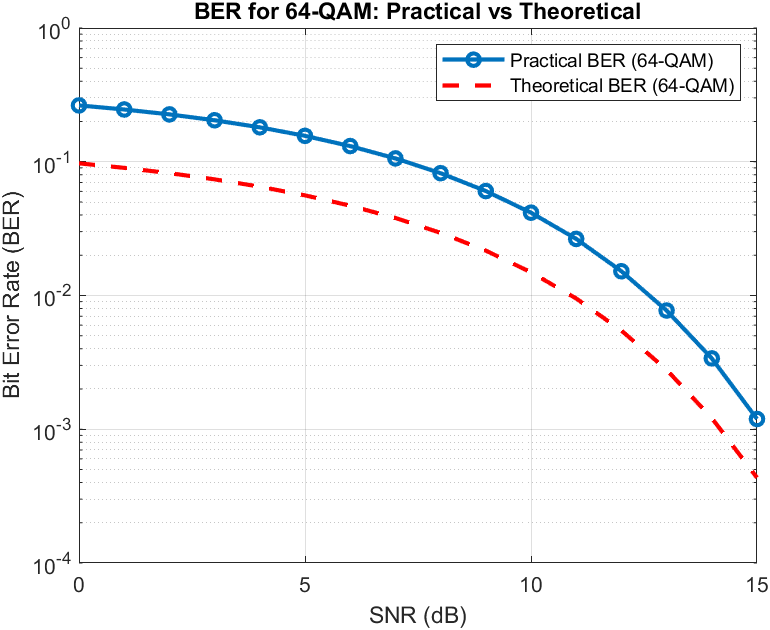

# QAM Modulator and Demodulator

Этот проект представляет собой реализацию модулятора и демодулятора для QAM16, QAM64. Он включает в себя генерацию белого гауссовского шума и добавление его к сигналу для моделирования условий передачи данных.

## Функциональность

1. **Модулятор QAM**:
   - Реализует модуляцию для различных схем QAM, QAM16 и QAM64.

2. **Добавление гауссовского шума**:
   - Моделирует влияние белого гауссовского шума на сигнал.

3. **Демодулятор QAM**:
   - Реализует демодуляцию для различных схем QAM.

## Использование

1. Скомпилируйте проект.
2. Запустите программу введите число 16 или 64 в зависимости от желаемого типа модуляции.
3. Будут создан txt файл QAM.
4. Эти файлы обрабатываются программой написанной в pictures.m (Matlab) в которой нужно явно указать число M

## Примеры

Ниже приведены примеры зависимости BER от SNR для 16-QAM и 64-QAM полученные практической модуляцией и теоритическая зависимость. Мы наблюдаем отсутствие данных после достижения snr  значения 4  это связанно с тем что из за того что сигнал превосходит шум в разы то наши данные перестают искажаться настолько чтобы мы получали ошибки.

## Задачи

- Написать на языке C++ класс, выполняющий функциональность модулятора QAM (QPSK, QAM16, QAM64).
- Написать на языке C++ класс, выполняющий функциональность добавления гауссовского шума к созвездию QAM.
- Написать на языке C++ класс, выполняющий функциональность демодулятора QAM (QPSK, QAM16, QAM64).
- Написать последовательный вызов классов 1-3 для случайной последовательности бит для разных значений дисперсии шума.
- Построить график зависимости вероятности ошибки на бит от дисперсии шума.
